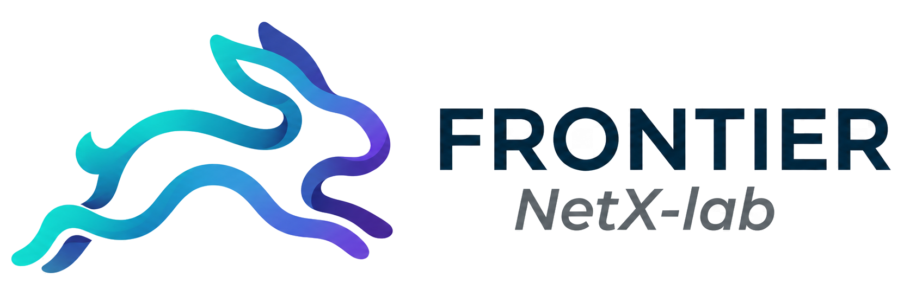
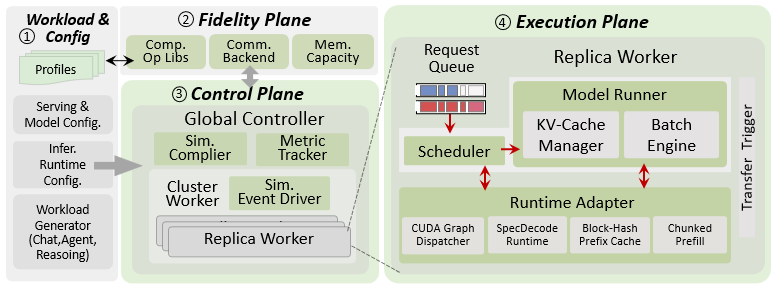
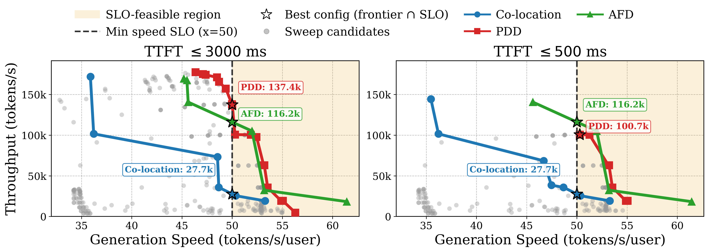
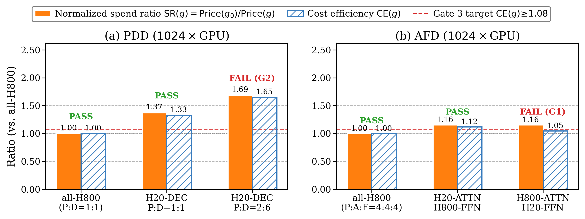
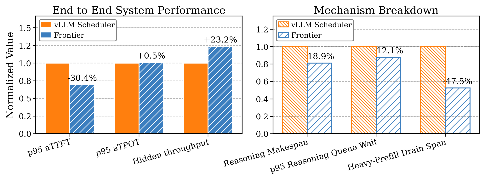
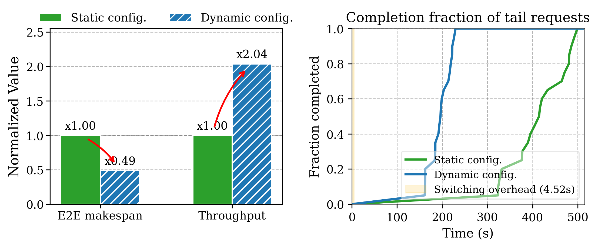

<div align="center">



# Frontier

<h4>A Discrete-Event Simulator for Modern LLM Serving</h4>

[](./docs)
[](#latest-news-)
[](./LICENSE)
[](https://arxiv.org/abs/2605.21312)

<div align="left">

## Latest News 🎯
📍[2026/07] We refactored the operator registration module to improve support and integration for diverse models and attn algorithms. More examples will be provided, including how to use Frontier for end-to-end simulation of a new/customized model.<br />
📍[2026/06] Prefill-Decode Disaggregation (PDD) version released! Support for Attention-FFN Disaggregation (AFD) will be available soon.<br />
📍[2026/06] Initial version released, with support for co-located serving and modern optimizations.<br />

## Frontier Overview

Frontier is a discrete-event simulator for modern LLM serving. It is built for serving systems that combine complex parallelism, runtime optimizations, sparse model architectures (MoE), and stateful workloads (reasoning agents, RL rollouts). It currently simulates vLLM-style serving behavior, and we plan to include other serving engines soon.

Frontier helps researchers and engineers better understand serving system designs and tradeoffs without the time and financial costs of repeatedly deploying on GPU clusters.

<div align="left">
  
</div>

### Key Features

- **Co-located & Disaggregated Serving**: This branch supports monolithic co-location and PDD serving. AFD support is planned for a later public release.
- **Modern Runtime Optimizations**: Frontier captures production techniques such as CUDA Graph, speculative decoding / MTP, prefix caching, quantization, chunked prefill, and hierarchical caching as part of the scheduler-batch-engine loop. These optimizations change batch shape, memory state, and per-request progress, so Frontier models them as runtime behavior rather than simple speedup factors.
- **Fidelity**: Frontier combines calibrated operator, communication, transfer, and KV-cache memory models to make simulation results useful for deployment decisions. This helps users compare configurations under SLA constraints, explore large GPU-scale design spaces ex-situ, and avoid conclusions that would be distorted by coarse average-case models.

> AFD serving architecture is intentionally not included in this release and will be available in a later public release.

## Minimum Hardware Requirements

- **Simulation:** Frontier supports E2E execution entirely on CPU-only machines, leveraging pre-compiled profiling databases.
- **Profiling:** At least **1 GPU** is required exclusively for running the Frontier profiling module to collect operator-level performance metrics on new hardware or software stacks.

## Use Cases

Frontier is designed for what-if studies that would be expensive or slow to run directly on large GPU clusters. The current paper draft demonstrates four use cases.

<table align="center">
  <tr>
    <td width="50%" align="center" valign="top">
      <strong>SLA-Aware Pareto Frontier Search</strong><br />
      Find the best serving architecture and parallelism configuration under TTFT and generation-speed constraints.<br /><br />
      
    </td>
    <td width="50%" align="center" valign="top">
      <strong>Heterogeneous GPU Allocation</strong><br />
      Study when disaggregated role placement can turn cheaper GPU types into real cost efficiency while still meeting SLA targets.<br /><br />
      
    </td>
  </tr>
  <tr>
    <td width="50%" align="center" valign="top">
      <strong>Stateful Reasoning Scheduler Validation</strong><br />
      Validate scheduling policies for multi-round reasoning workloads with hidden planning, tool calls, and prefix-cache continuity.<br /><br />
      
    </td>
    <td width="50%" align="center" valign="top">
      <strong>Dynamic Reconfiguration for RL Rollouts</strong><br />
      Test whether switching parallelism layouts during rollout execution can reduce long-tail makespan before implementing it in a production stack.<br /><br />
      
    </td>
  </tr>
</table>

## Quick Start and Examples

Install the release package and test extras from the repository root:

```bash
python -m pip install -e '.[test]'
PYTHONPATH=$PWD PYTHONDONTWRITEBYTECODE=1 pytest tests/unit/test_examples_pdd_scripts.py -q -p no:cacheprovider
```

Current release-facing PDD and co-location examples are split by simulation mode and default to the formula-based `analytical` backend for one-click smoke runs:

- `examples/architecture/pdd/offline/dense_model_basic.sh`
- `examples/architecture/pdd/online/dense_model_basic_online.sh`
- `examples/architecture/co-location/online/dense_model_basic_online.sh`
- `examples/architecture/co-location/online/moe_model_basic_online.sh`
- `examples/architecture/co-location/online/thinking_mode_basic_online.sh`

These examples cover most runtime optimizations. Note that dummy analytical smoke runs only validate runtime plumbing, not profiling fidelity. Profiling outputs and reusable compute data are organized under data/profiling/compute.

> Currently, only the `h800` and `rtx_pro_6000` datasets contain full-feature format profiles; we highly recommend re-collecting profiling data locally for your specific hardware.

Example fixtures live under:

```text
examples/
├── architecture/
│   ├── pdd/
│   │   ├── run_all.sh
│   │   ├── offline/
│   │   └── online/
│   └── co-location/
│       ├── run_all.sh
│       ├── offline/
│       └── online/
├── fixtures/
└── profiling/
```

## Communication Backend

The release example suites default to the lightweight formula-based backend for one-click smoke runs:

```bash
--cc_backend_config_type analytical
```

The ASTRA-Sim-inspired topology model remains available for direct CLI experiments:

```bash
--cc_backend_config_type astra_sim_analytical
```

`collective_sim` is optional and is used only when you explicitly select `--cc_backend_config_type collective_sim`.

To enable the optional target-runtime backend:

```bash
git submodule update --init --recursive frontier/cc_backend/backends/collective-sim
cd frontier/cc_backend/backends/collective-sim/sim
make -j"$(nproc)"
```

After building, verify that `frontier/cc_backend/backends/collective-sim/sim/datacenter/htsim_ndp` exists before selecting `--cc_backend_config_type collective_sim`.

If your host C++ runtime reports a GLIBC or GLIBCXX mismatch, rebuild the optional backend in the target runtime:

```bash
make -B -j"$(nproc)"
```

## Environment and Docker

For the standard simulator environment, install from `environment.yml` or use editable `pip` installation. Profiling wrappers use a dedicated environment because vllm and flashinfer can be sensitive to CUDA and Python versions:

```bash
conda env create -f environment_profiling.yml
conda activate frontier-profiling
```

Do not blindly install profiling dependencies into an existing environment unless you have confirmed version compatibility.

Production Docker users can start from the public image:

```bash
docker pull fengyicheng/frontier-env
docker run --rm --gpus all --shm-size 16g \
  --tmpfs /workspace/frontier/outputs \
  --tmpfs /workspace/frontier/cache \
  -v "$PWD":/workspace/frontier \
  -w /workspace/frontier \
  fengyicheng/frontier-env bash
```

## Plan

We will continuously release Frontier's core components to the community. We are actively developing new features and plan to support:

- **Serving Engines Integration**: Support for SGLang and TensorRT-LLM frameworks.
- **Advanced Caching**: Support for `tair-kvcache` as an advanced runtime backend for the Hierarchical Caching feature.
- **Advanced Model Support**: Expanded support for state-of-the-art models such as DeepSeek-V4, Kimi 2.5, and more.
- **Simulation Acceleration**: Introduce more simulation acceleration mechanisms.

## Acknowledgments

Frontier is mainly built on top of Vidur. The following great systems have been referenced or adapted as runtime backends. We sincerely thank all the developers for their contributions to the community!

- [**Vidur**](https://github.com/microsoft/vidur)
- [**ASTRA-Sim**](https://github.com/astra-sim/astra-sim)
- [**htsim**](https://github.com/Broadcom/csg-htsim)
- [**AIConfigurator**](https://github.com/ai-dynamo/aiconfigurator)

## Citation

If you use this repo in your research, please cite our arXiv paper:

```bibtex
@article{feng2026frontier,
  title={Frontier: Towards Comprehensive and Accurate LLM Inference Simulation},
  author={Feng, Yicheng and Tan, Xin and Deng, Yangtao and Jiang, Yimin and Zhu, Yibo and Xu, Hong},
  journal={arXiv preprint arXiv:2605.21312},
  year={2026}
}
```

## Contact

Email **Yicheng Feng** (<yichengfeng@link.cuhk.edu.hk>) or **Hong Xu** (<hongxu@cuhk.edu.hk>) if you have any questions.

Feedback, issues, and PRs are highly welcome. We welcome your contributions!

<div align="left">
  
</div>

## License

This project is licensed under the MIT license - see the [LICENSE](LICENSE) file for details.
