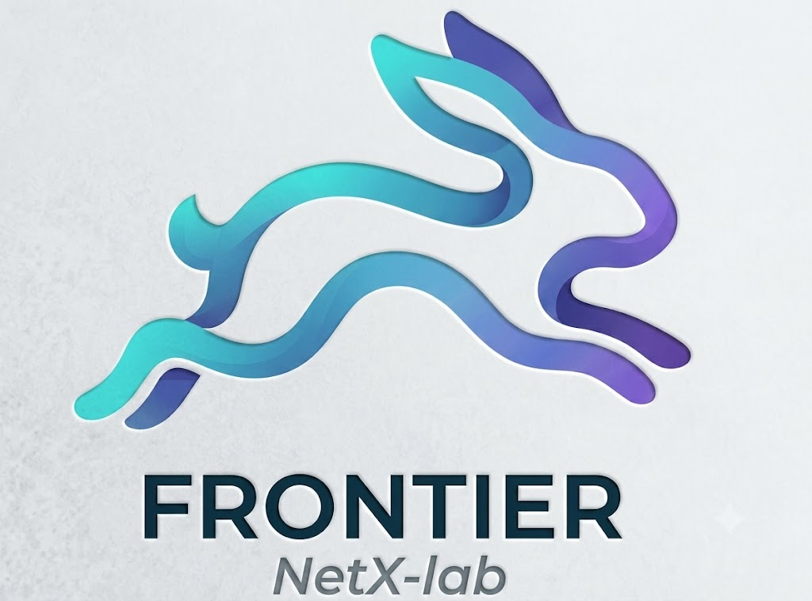

<div align="center">
  <h1>
    
    Frontier: A Discrete-Event Simulator for Modern LLM Inference Serving
  </h1>
</div>

## Latest News 🎯

📍[2026/06] We have released the initial version of Frontier, which supports co-located serving and modern optimizations. The disaggregated version will be available soon. Stay tuned!<br />
📍[2026/05] We are preparing for the initial open-source release of Frontier. The core simulation engine and documentation will be available soon.

## Frontier Overview

Frontier is a discrete-event simulator for modern LLM inference serving. It is built for serving systems that combine complex parallelism, runtime optimizations, MoE models, and stateful workloads such as reasoning agents and RL rollouts.

Frontier helps researchers and engineers study large serving designs without repeatedly deploying expensive GPU clusters. The current `pre-release-v0.1` public branch models co-location only, while Prefill-Decode Disaggregation (PDD) and Attention-FFN Disaggregation (AFD) remain roadmap items.

<div align="left">
  
</div>

### Key Features

- **Co-location Serving System**: This branch models a monolithic co-location serving cluster. PDD and AFD support is planned for a later public release.
- **Modern Runtime Optimizations**: Frontier captures production techniques such as CUDA Graph, speculative decoding / MTP, prefix caching, quantization, chunked prefill, and hierarchical caching as part of the scheduler-batch-engine loop. These optimizations change batch shape, memory state, and per-request progress, so Frontier models them as runtime behavior rather than simple speedup factors.
- **Decision-Fidelity**: Frontier combines calibrated operator, communication, transfer, and KV-cache memory models to make simulation results useful for deployment decisions. This helps users compare configurations under SLA constraints, explore large GPU-scale design spaces ex-situ, and avoid conclusions that would be distorted by coarse average-case models.

> Disaggregated architectures are intentionally not included in this release but will be available soon. Stay tuned!

## How Frontier Models Serving Systems

Frontier treats serving as a sequence of events over time. Requests arrive, enter scheduler queues, form batches, execute through model stages, and finally emit metrics such as TTFT, TPOT, throughput, and end-to-end latency.

At a high level, Frontier is organized around four user-facing concepts:

- **Workload and Config**: Describe the model, hardware, serving architecture, parallelism, runtime options, and request workload.
- **Fidelity Plane**: Provides calibrated estimates for operator runtime, communication cost, transfer delay, and KV-cache capacity.
- **Control Plane**: Compiles the serving specification into co-location execution flows for this release.
- **Execution Plane**: Advances requests through scheduling, batching, and runtime adapters.

This design lets Frontier study both traditional serving deployments and newer workloads whose behavior depends on hidden state, phase changes, or multi-step sessions.

## Minimum Hardware Requirements

- **Simulation:** Frontier supports E2E execution entirely on CPU-only machines, leveraging pre-compiled profiling databases.
- **Profiling:** At least **1 GPU** is required exclusively for running the Frontier profiling module to collect operator-level performance metrics on new hardware or software stacks.

## Use Cases

Frontier is designed for what-if studies that would be expensive or slow to run directly on large GPU clusters. The current paper draft demonstrates four use cases. This public branch currently exposes the co-location path; disaggregated use cases are roadmap examples.

<table align="center">
  <tr>
    <td width="50%" align="center" valign="top">
      <strong>SLA-Aware Pareto Frontier Search</strong><br />
      Find the best serving architecture and parallelism configuration under TTFT and generation-speed constraints.<br /><br />
      
    </td>
    <td width="50%" align="center" valign="top">
      <strong>Heterogeneous GPU Allocation</strong><br />
      Study when PDD and AFD role placement can turn cheaper GPU types into real cost efficiency while still meeting SLA targets.<br /><br />
      
    </td>
  </tr>
  <tr>
    <td width="50%" align="center" valign="top">
      <strong>Stateful Reasoning Scheduler Validation</strong><br />
      Validate scheduling policies for multi-round reasoning workloads with hidden planning, tool calls, and prefix-cache continuity.<br /><br />
      
    </td>
    <td width="50%" align="center" valign="top">
      <strong>Dynamic Reconfiguration for RL Rollouts</strong><br />
      Test whether switching parallelism layouts during rollout execution can reduce long-tail makespan before implementing it in a production stack.<br /><br />
      
    </td>
  </tr>
</table>

## Quick Start and Examples

Install the release package and test extras from the repository root:

```bash
python -m pip install -e '.[test]'
PYTHONPATH=$PWD PYTHONDONTWRITEBYTECODE=1 pytest tests/unit/test_open_source_release_arch_guard.py -q -p no:cacheprovider
```

Current release-facing examples default to the ASTRA-Sim analytical backend:

- `examples/architecture/co-location/dense_model_basic.sh`
- `examples/architecture/co-location/moe_model_basic.sh`
- `examples/architecture/co-location/thinking_mode_basic.sh`
- `examples/architecture/co-location/moe_spec_dec.sh`
- `examples/architecture/co-location/moe_prefix_caching.sh`

Feature examples include `decode_cuda_graph_mode`, Chunked Prefill, Speculative Decoding / MTP, and Prefix Caching. Example fixtures live under:

```text
examples/
├── architecture/
├── fixtures/
└── profiling/
```

## Communication Backend

The default public example backend is ASTRA-Sim analytical:

```bash
--cc_backend_config_type astra_sim_analytical
```

collective_sim is optional and is used only when you explicitly select `--cc_backend_config_type collective_sim`.

To enable the optional target-runtime backend:

```bash
git submodule update --init --recursive frontier/cc_backend/backends/collective-sim
cd frontier/cc_backend/backends/collective-sim/sim
make -j"$(nproc)"
```

If your host C++ runtime reports a GLIBC or GLIBCXX mismatch, rebuild the optional backend in the target runtime:

```bash
make -B -j"$(nproc)"
```

## Environment and Docker

For the standard simulator environment, install from `environment.yml` or use editable `pip` installation. Profiling wrappers use a dedicated environment because vllm and flashinfer can be sensitive to CUDA and Python versions:

```bash
conda env create -f environment_profiling.yml
conda activate frontier-profiling
```

Do not blindly install profiling dependencies into an existing environment unless you have confirmed version compatibility.

Production Docker users can start from the public image:

```bash
docker pull fengyicheng/frontier-env
docker run --rm --gpus all --shm-size 16g \
  --tmpfs /workspace/frontier/outputs \
  --tmpfs /workspace/frontier/cache \
  -v "$PWD":/workspace/frontier \
  -w /workspace/frontier \
  fengyicheng/frontier-env bash
```

The image may contain an image-specific Python path. Set `FRONTIER_DOCKER_PYTHON` after you replace this path with the correct interpreter for your image:

```bash
find / -path '*/envs/vidur_te/bin/python' -type l -o -path '*/envs/vidur_te/bin/python' -type f 2>/dev/null
export FRONTIER_DOCKER_PYTHON=/path/to/your/python
"$FRONTIER_DOCKER_PYTHON" -c "import pytest"
```

If that check prints `Python executable not found`, inspect the image-specific environment layout before running tests. For GPU runs, verify NVIDIA Container Toolkit installation, driver compatibility, and `nvidia-smi`.

FlashInfer JIT kernels require `nvcc`. If the container or conda environment does not expose it, install `cuda-nvcc` and confirm `CUDA_HOME` points to the matching CUDA toolkit.

## Plan

We will gradually release Frontier's core components to the community.

We are actively developing new features and plan to support:

- **Simulation Acceleration**: Introduce more simulation acceleration mechanisms.
- **Serving Engines Integration**: Support for SGLang and TensorRT-LLM frameworks.
- **Advanced Caching**: Support for `tair-kvcache` as an advanced runtime backend for the Hierarchical Caching feature.
- **Advanced Model Support**: Expanded support for state-of-the-art models such as DeepSeek-V4, Kimi 2.5, and more.

## Acknowledgments

Frontier is mainly built on top of Vidur. The following great works have been referenced or adapted as runtime backends during the development of Frontier. We sincerely thank the authors for their contributions to the community!

- [**Vidur**](https://github.com/microsoft/vidur)
- [**ASTRA-Sim**](https://github.com/astra-sim/astra-sim)
- [**htsim**](https://github.com/Broadcom/csg-htsim)

## Citation

If you use this repo in your research, please cite our paper (citation details will be added after the paper is released):

```bibtex
@article{feng2026frontier,
  title={Frontier: Towards Comprehensive and Accurate LLM Inference Simulation},
  author={Feng, Yicheng and Tan, Xin and Deng, Yangtao and Jiang, Yimin and Zhu, Yibo and Xu, Hong},
  journal={arXiv preprint arXiv:2605.21312},
  year={2026}
}
```

## Contact

Email **Yicheng Feng** (<yichengfeng@link.cuhk.edu.hk>) if you have any questions.

Feedback, issues, and PRs are highly welcome! We would love for you to join the Frontier community.

## License

This project is licensed under the MIT license - see the [LICENSE](LICENSE) file for details.
